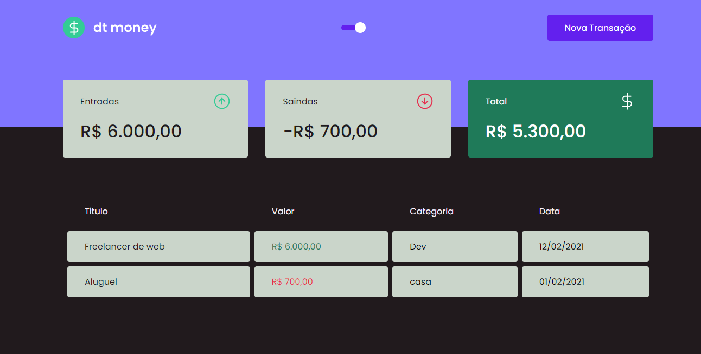

<h1 align='center'>Money Prog</h1>

Aplicação de controleo de gasto, pode adicionar entradas e saidas

## Tech Usada
<ul>

<li>ReactJS</li>
<li>Hooks</li>
<li>Context API</li>
<li>Axios</li>
<li>MirageJs</li>
</ul>